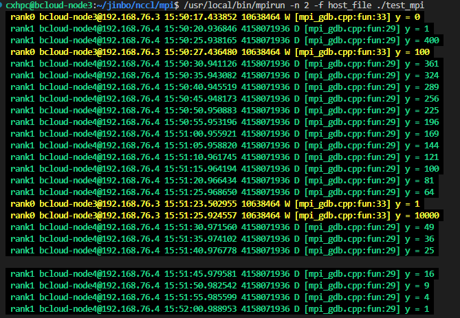

### 使用 gdb 调试 mpi 程序

```C
int gNodeNum;  // 节点总数
int gRank;     // 当前的节点

int fun(int x)
{
    int y = x * x;
    if (gRank)
    {
        logd("y = %d", y);
    }
    else
    {
        logw("y = %d", y);
    }

    return y;
}

int main(int argc, char **argv)
{
    int ret = 0;

    std::string ip = get_local_ip();
    // printf("ip = %s\n", ip.c_str());
    if (std::string("192.168.76.3") == ip)
    {
        gRank = 0;
    }
    else
    {
        gRank = 1;
    }
    gNodeNum = 2;

    fun(gRank);

    printf("\n");
    int flag = 10;
    while (flag)   // 为了有时间 gdb attach 上来，方便调试，让程序在该处停留一段时间
    {
        sleep(10);
        fun(flag--);
    }

    fun(100 + gRank);

    return 0;
}
```

首先运行程序 ./test_mpi

```shell
$ /usr/local/bin/mpirun -n 2 -f host_file ./test_mpi
```

根据名字获得进程的id

```shell
$ ~/jinbo/nccl$ pgrep test_mpi
999754
```

使用 gdb 调试

```shell
$ sudo gdb attach 999754
```

```shell
Attaching to process 999754
Reading symbols from /home/cxhpc/jinbo/nccl/mpi/test_mpi...
Reading symbols from /lib/x86_64-linux-gnu/libstdc++.so.6...
(No debugging symbols found in /lib/x86_64-linux-gnu/libstdc++.so.6)
Reading symbols from /lib/x86_64-linux-gnu/libgcc_s.so.1...
(No debugging symbols found in /lib/x86_64-linux-gnu/libgcc_s.so.1)
Reading symbols from /lib/x86_64-linux-gnu/libc.so.6...
Reading symbols from /usr/lib/debug/.build-id/18/78e6b475720c7c51969e69ab2d276fae6d1dee.debug...
Reading symbols from /lib/x86_64-linux-gnu/libm.so.6...
Reading symbols from /usr/lib/debug/.build-id/fe/91b4090ea04c1559ff71dd9290062776618891.debug...
Reading symbols from /lib64/ld-linux-x86-64.so.2...
Reading symbols from /usr/lib/debug/.build-id/45/87364908de169dec62ffa538170118c1c3a078.debug...
0x00007f9900c521b4 in __GI___clock_nanosleep (clock_id=<optimized out>, clock_id@entry=0, flags=flags@entry=0, req=req@entry=0x7ffe77c95ff0, rem=rem@entry=0x7ffe77c95ff0)
    at ../sysdeps/unix/sysv/linux/clock_nanosleep.c:78
78      ../sysdeps/unix/sysv/linux/clock_nanosleep.c: No such file or directory.
(gdb) n
80      in ../sysdeps/unix/sysv/linux/clock_nanosleep.c
(gdb) n
117     in ../sysdeps/unix/sysv/linux/clock_nanosleep.c
(gdb) n
__GI___nanosleep (requested_time=requested_time@entry=0x7ffe77c95ff0, remaining=remaining@entry=0x7ffe77c95ff0) at nanosleep.c:28
28      nanosleep.c: No such file or directory.
(gdb) n
__sleep (seconds=0) at ../sysdeps/posix/sleep.c:62
62      ../sysdeps/posix/sleep.c: No such file or directory.
(gdb) n
64      in ../sysdeps/posix/sleep.c
(gdb) n
main (argc=1, argv=0x7ffe77c961a8) at mpi_gdb.cpp:62
62              fun(flag--);
(gdb) p flag=1 ############## 通过修改 flag 让程序退出 while 循环
$1 = 1
(gdb) n
59          while (flag)
(gdb) n
65          fun(100 + gRank);
(gdb) n
83          return 0;
(gdb) n
43          std::string ip = get_local_ip();
(gdb) n
84      }
(gdb) n
__libc_start_main (main=0x5566462d8eee <main(int, char**)>, argc=1, argv=0x7ffe77c961a8, init=<optimized out>, fini=<optimized out>, rtld_fini=<optimized out>,
    stack_end=0x7ffe77c96198) at ../csu/libc-start.c:342
342     ../csu/libc-start.c: No such file or directory.
(gdb) q
A debugging session is active.

        Inferior 1 [process 999754] will be detached.

Quit anyway? (y or n) y
Detaching from program: /home/cxhpc/jinbo/nccl/mpi/test_mpi, process 999754
[Inferior 1 (process 999754) detached]

```

终端输出结果如下图，可以看到服务器76.3打印y=100的时候，gdb attach 上去，此时另一台服务器 76.4 依旧在运行，因为是在服务器 76.3 上 attach  进程的，导致该进程被 gdb 接管。现在修改服务器 76.3 上的进程的 flag=1，使其退出 while 循环，可以看到76.3 上的进程比76.4上的进程先执行完。

