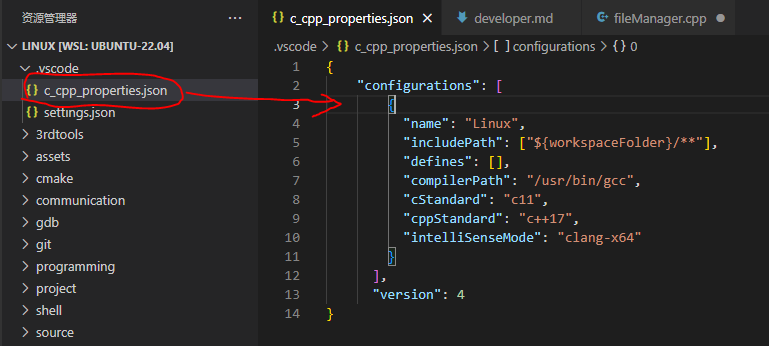

## 开发

### github 配置ssh key

git clone支持https和git（即ssh）两种方式下载源码：

- 使用https下载后，每次git pull需要再次输入账号密码，很麻烦。

- 使用ssh的方式，配置一次 ssh，后面每次git push，git pull都不用再次输入账号密码。


下面就介绍一下如何配置git的ssh key，以便我们可以用git方式下载源码。

```shell
# 检查一下用户名和邮箱是否配置
git config --global  --list 
# 如果未配置，使用下面命令配置
git config --global  user.name "你的用户名"
git config --global user.email "你的邮箱"
```

生成密匙

```shell
ssh-keygen -t rsa -C "你的邮箱"
```

执行命令后需要进行3次或4次确认：

1. 确认秘钥的保存路径（如果不需要改路径则直接回车）；
2. 如果上一步置顶的保存路径下已经有秘钥文件，则需要确认是否覆盖（如果之前的秘钥不再需要则直接回车覆盖，如需要则手动拷贝到其他目录后再覆盖）；
3. 创建密码（如果不需要密码则直接回车）；
4. 确认密码；

之后生成文件`.ssh/id_rsa.pub`，拷贝里面的`所有内容`复制到


再次尝试用git方式下载，可以看到已经可以正常下载了。

### [Windows + WSL2 + vscode 解决头文件不能跳转的问题](https://code.visualstudio.com/docs/cpp/config-linux#_reusing-your-c-configuration)



将 `.vscode/c_cpp_properties.json`改成如下所示：

```shell
{
  "configurations": [
    {
      "name": "Linux",
      "includePath": ["${workspaceFolder}/**"],
      "defines": [],
      "compilerPath": "/usr/bin/gcc",
      "cStandard": "c11",
      "cppStandard": "c++17",
      "intelliSenseMode": "clang-x64"
    }
  ],
  "version": 4
}
```

### Pycharm

官网下载安装包后，按下列方式安装并启动

```shell
tar -xvzf pycharm-community-*tar.gz
cd pycharm-community*/bin
sh pycharm.sh
```

对 Ubuntu 18，固定图标到任务栏没有 Ubuntu 16 方便，如果要把图标固定在任务栏，则：

```
cd ~/.local/share/applications/
sudo gedit PyCharm.desktop
```

在 Pycharm.desktop 里填入以下内容：

```shell
[Desktop Entry]
Version=1.0
Terminal=false
Type=Application
Name=PyCharm
Exec=/home/user/soft/pycharm-community-2020.2.1/bin/pycharm.sh
Icon=/home/user/soft/pycharm-community-2020.2.1/bin/pycharm.png
NoDisplay=false
StartupWMClass=jetbrains-pycharm-ce
```

其中`Exec`表示安装软件的启动文件路径，`Icon` 表示安装软件的图标路径。保存后，右键点击刚生成的应用图标，选择添加到收藏夹，就会固定在任务栏。但双击任务栏的图标会出现双图标的现象，解决办法，终端输入`xprop |grep WM_CLASS`此时鼠标会变成十字准心，然后点击一下正在运行的软件，终端会反馈一条信息，包括2个字符串。显示如下：

```shell
$ xprop |grep WM_CLASS
WM_CLASS(STRING) = "jetbrains-pycharm-ce", "jetbrains-pycharm-ce"
```

将输出的字符串填入`PyCharm.desktop`的`StartupWMClass`变量。

参考[Ubuntu18.04软件图标（PyCharm）固定菜单栏方法](https://blog.csdn.net/ayue1220/article/details/90701463)

### Android Studio

SDK和Android studio都安装在`/usr/local/` 下，分别建文件夹 `java/jdk_14.0.2`和`java/android-studio`

```shell
$ cd /usr/local/
$ mkdir java
$ cd java
$ mkdir jdk_14.0.2
$ mkdir android-studio
```

1、Sdk 安装，[点击下载](https://www.oracle.com/java/technologies/javase-jdk14-downloads.html)

```shell
# 解压 JDK
sudo tar -zxvf jdk-14.0.2_linux-x64_bin.tar.gz
# 在jdk文件夹中输入以下命令生成jre
sudo bin/jlink --module-path jmods --add-modules java.desktop --output jre
```

2、Android Studio安装，[点击下载](https://developer.android.google.cn/studio/)
bin文件夹下：./studio.sh
除了要 costom，其他默认。
然后第一次启动，安装一堆工具包。有问题一定是网络的问题，首先考虑换热点。

环境：

```shell
sudo gedit ~/.bashrc
```

在末尾填入：

```shell
# java
export JAVA_HOME=/usr/local/java/jdk_14.0.2
export JRE_HOME=${JAVA_HOME}/jre
export CLASSPATH=.:{JAVA_HOME}/lib:${JRE_HOME}/lib
export PATH=${JAVA_HOME}/bin:$PATH

# android studio
export ANDROID_HOME=/usr/local/java/android-stodio/bin
export PATH=$PATH:$ANDROID_HOME

# android SDK
export ANDROID_SDK_HOME=/home/user/Android/Sdk
export PATH=$PATH:$ANDROID_SDK_HOME/platform-tools
```

最后激活配置：

```shell
source   ~/.bashrc
```

固定图标到任务栏

```shell
cd ~/.local/share/applications/
sudo gedit AndroidStudio.desktop
```

在 AndroidStudio.desktop 里填入以下内容：

```shell
[Desktop Entry]
Version=1.0
Terminal=false
Type=Application
Name=Android Studio
Exec=/usr/local/java/android-studio/bin/studio.sh
Icon=/usr/local/java/android-studio/bin/studio.png
NoDisplay=false
StartupWMClass=jetbrains-studio
```

这时双击任务栏的图标会出现双图标的现象，解决办法，终端输入`xprop |grep WM_CLASS`此时鼠标会变成十字准心，然后点击一下正在运行的软件，终端会反馈一条信息，包括2个字符串。显示如下：

```shell
$ xprop |grep WM_CLASS
WM_CLASS(STRING) = "sun-awt-X11-XFramePeer", "jetbrains-studio"
```

将输出的字符串`jetbrains-studio`填入`PyCharm.desktop`的`StartupWMClass`变量。实际上把`sun-awt-X11-XFramePeer`填入`StartupWMClass`变量也没问题。

## 配置

### [中文 man](https://blog.csdn.net/BobYuan888/article/details/88865219)

```shell
sudo apt-get update                              # 更新你的下载源目录，此步骤可省略。
sudo apt-get install manpages-zh   # 系统会自动下载并安装
sudo gedit ~/.bashrc                             # 在最后一行输入：alias cman='man -M /usr/share/man/zh_CN'  
                                                                       # 将中文的man命令重命名为cman命令，之后保存并退出编辑
source ~/.bashrc                                     # 重新运行.bashrc文件
```

## 代码跟踪

### sourcetrail

[下载](https://github.com/CoatiSoftware/Sourcetrail/releases)

解压后运行`install.sh`脚本

### doxygen

```shell
sudo apt-get install doxygen
sudo apt-get install graphviz
```

**Usage**

获取[配置文件](./src/Doxyfile)

```shell
$ doxygen -g
# 此时用获取的配置文件覆盖掉新创建的配置文件
$ doxygen 
```

**参考**

- [Linux 下 Doxygen 安装及使用大全](https://blog.csdn.net/t990423909/article/details/106169890)
- [配置文件设置](https://www.cnblogs.com/Mr--Yang/p/6338095.html)

## 常用软件

### teamviewer

```
$ sudo dpkg -i teamviewer*.deb
```

不出意外会出现一些错误，需要安装一些依赖。使用下面的修复依赖关系的命令：

```
$ sudo apt-get install -f
```

再次执行命令:

```
$ sudo dpkg -i teamviewer*.deb
```

### 百度网盘

[下载 .deb 格式的软件包](https://pan.baidu.com/download)

```shell
$ sudo dpkg -i baidunetdisk_3.4.1_amd64.deb
```

### 微信

[下载微信安装包](https://www.cnblogs.com/limanjihe/p/9963574.html)

链接: https://pan.baidu.com/s/1YIswiB6UnTPsVD2K162j8w  密码: 0wtt

```shell
# 解压后
$ electronic-wechat
# 如果不能启动，则
$ sudo snap install electronic-wechat
$ electronic-wechat
```

## 娱乐软件

### 网易云

```
sudo dpkg -i netease-cloud-music*.deb
```

显示安装错误，因为缺少依赖,使用如下命令安装相关依赖：

```
sudo apt-get install -f 
```

再重复安装命令:

```
sudo dpkg -i netease-cloud-music*.deb
```

启动客户端：

```
netease-cloud-music
```

参考链接： [网易云安装](https://blog.csdn.net/zz531987464/article/details/83050067)

## 其它

### amule

aMule是一个开源免费的P2P文件共享软件，遵循GNU通用公共许可证协议发布。类似于eMule。基于xMule和lMule。可应用eDonkey网络协议，也支持KAD网络。可在包括各种类Unix系统、Windows在内的多种操作系统下运行。

主要用它来下载MSDN里的ed2k格式链接

```shell
sudo apt-get install amule
```


### VMware

[点击下载vmware pro16](https://my.vmware.com/cn/web/vmware/downloads/info/slug/desktop_end_user_computing/vmware_workstation_pro/16_0)

```shell
wget -c https://download3.vmware.com/software/wkst/file/VMware-Workstation-Full-16.0.0-16894299.x86_64.bundle
sudo chmod +x VMware-Workstation-Full-16.0.0-16894299.x86_64.bundle 
sudo ./VMware-Workstation-Full-16.0.0-16894299.x86_64.bundle
```

```markdown
# 许可密钥文本，复制其中一条然后点击激活即可
ZF3R0-FHED2-M80TY-8QYGC-NPKYF
YF390-0HF8P-M81RQ-2DXQE-M2UT6
ZF71R-DMX85-08DQY-8YMNC-PPHV8
```

参考：

- [vmware workstation16许可证密钥附使用说明](http://blog.itpub.net/69983919/viewspace-2721808/)
- [ubuntu19.10安装vmware workstation pro(详细步骤)](https://blog.csdn.net/weixin_42473164/article/details/104421386)

